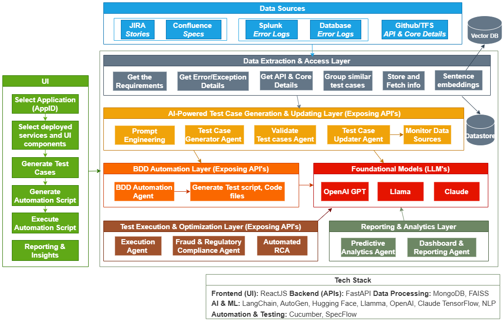

# 🚀 Project Name

## 📌 Table of Contents
- [Introduction](#introduction)
- [Demo](#demo)
- [Inspiration](#inspiration)
- [What It Does](#what-it-does)
- [How We Built It](#how-we-built-it)
- [Challenges We Faced](#challenges-we-faced)
- [How to Run](#how-to-run)
- [Tech Stack](#tech-stack)
- [Team](#team)

---
## 🎯 Introduction
The **Context-Aware AI-Driven Testing System** is an advanced, multi-agent AI-powered framework designed to automate financial test generation, execution, fraud detection, and compliance validation. This system leverages Generative AI with LLM’s, NLP, and ML models to create dynamic test cases from various financial data sources, ensuring optimal accuracy, security, and efficiency in financial transactions.

## Solution Presentation
[Soltution Presentation](https://github.com/ewfx/catfe-ai-challengers/tree/main/artifacts/arch/Context-aware-Financial-Testing-System.pdf
(Download Presentation **Context-aware-Financial-Testing-System.pdf** from artifacts/arch folder or click on link.)  

## Solution Architecture
**Architecture Diagram:**


**Sequence Diagram:**


## 🎥 Demo
📹 [Video Demo]
[Full Video Demo](https://github.com/ewfx/catfe-ai-challengers/tree/main/artifacts/demo/Context-aware-Financial-Testing-System.mp4) (Download demo video from artifacts/demo folder or click on link.)  

<video width="600" controls>
  <source src="./artifacts/demo/Context-aware-Financial-Testing-System.mp4" type="video/mp4">
  Your browser does not support the video tag.
</video>

[Intro and Automation Demo](https://github.com/ewfx/catfe-ai-challengers/tree/main/artifacts/demo/Intro_Demo.mp4) (Download demo video from artifacts/demo folder or click on link.)  
[Code Walk-through Demo](https://github.com/ewfx/catfe-ai-challengers/tree/main/artifacts/demo/Code_walk.mp4) (Download demo video from artifacts/demo folder or click on link.)  

🖼️ Screenshots:
**Generate Testcases**

**Generate Automation Script**

**API Endpoints**


## 💡 Inspiration
- Financial institutions operate within complex ecosystems comprising multiple interconnected systems, applications and API’s. Testing these ecosystems often relies on static mock tools leading to inefficiencies and high maintenance cost. Testers struggle to create real-world financial transaction test scenarios covering fraud detection, regulatory compliance, and risk assessment..
- Frequent updates to AML (Anti-Money Laundering), GDPR, PCI-DSS, SOX, and other compliance frameworks make manual compliance testing inefficient. Banking operations, fund transfers, KYC validation, and credit risk assessments involve multiple transaction layers that require end-to-end testing. Rapid changes in pricing algorithms, fraud detection mechanisms, and AI-driven financial decision-making introduce new test case requirements. Manual compliance testing fails to detect violations proactively.
- Traditional test automation frameworks lack parallel execution capabilities and efficient resource allocation. Running full regression test suites requires significant computing resources, increasing costs. Manual intervention for debugging and failure analysis adds delays and overhead. Manual compliance testing fails to detect violations proactively.

## ⚙️ What It Does
- The proposed solution is a multi-agent, AI-driven testing framework that dynamically generates, validates, executes, and optimizes test cases based on evolving system contexts. It integrates various data sources, extracts relevant information, and leverages Generative AI for intelligent test generation, validation, execution, and reporting.
Fetching the relevant information from multiple sources:
    1. JIRA & Confluence documents (Engineering specs, user stories).
    2. Splunk & Banking Logs (Error logs, transaction failures, security alerts).
    3. API Contracts & Financial Workflows (Payments, loan approvals, customer interactions).
    4. Database Exception Logs (SQL errors, fraud alerts, failed transactions)


## 🛠️ How We Built It
React for an interactive user interface. Flask for the backend API, FAISS(VectorDB) for data store and retrieval. LangChain for Orchestrating AI workflows and multi-agent LLM execution. OpenAI GPT Large language model for test case synthesis and automation

## 🚧 Challenges We Faced
- BDD automation script is returned as text instead of JSON formatted object from OpenAI GPT LLM. 

- We were using FAISS as a vector store but faced issues with reading the chunks and integrating them. We then tried using the CHROMA vector database and stored the chunks in in-memory databases (persistent storage). The data chunks were embedded and successfully accessed

## 🏃 How to Run
1. Clone the repository:
```bash
git clone https://github.com/ewfx/catfe-ai-challengers.git
```

2. Install backend dependencies:
```bash
cd catfe-ai-challengers
pip install -r requirements.txt
```

3. Start the backend server:
```bash
cd catfe-ai-challengers
python -m uvicorn app.main:app --host 0.0.0.0 --port 8000
```

4. Run the client app:
```bash
cd catfe-ai-challengers/clientapp/build
python -m http.server 4200
open url http://localhost:4200/genAI-testing-system/ in browser
```

## 🏗️ Tech Stack
- **Frontend (UI)**
  - **ReactJS** – Modern, responsive, and interactive user interface.
- **Backend (APIs)**
  - **FastAPI** – High-performance API framework for handling test case generation and execution.
- **Database & Storage**
  - **MongoDB** – NoSQL database for structured and semi-structured test data storage.
  - **FAISS (VectorDB)** – Efficient similarity search for AI-driven test case clustering and retrieval.
- **AI & Machine Learning**
  - **LangChain** – Orchestrating AI workflows and multi-agent LLM execution.
  - **AutoGen** – AI-driven automation and adaptive test case generation.
  - **Hugging Face** – Pre-trained NLP models for test analysis and optimization.
  - **Llama, OpenAI GPT, Claude**– Large language models for test case synthesis and automation.
  - **TensorFlow** – Machine learning framework for predictive analytics and anomaly detection.
  - **NLP (Natural Language Processing)** – Extracting insights from test logs and requirement documents.
- **Automation & Testing**
  - **Cucumber** – BDD (Behavior-Driven Development) test automation framework.
  - **SpecFlow** – BDD framework for .NET applications, ensuring smooth end-to-end testing.

## 👥 Team
-  **Nagarjuna Madupu**
-  **Sunirmal Sikder**
-  **Rama mohana rao Polagani**
-  **Eswara  srinivas Lanka**
