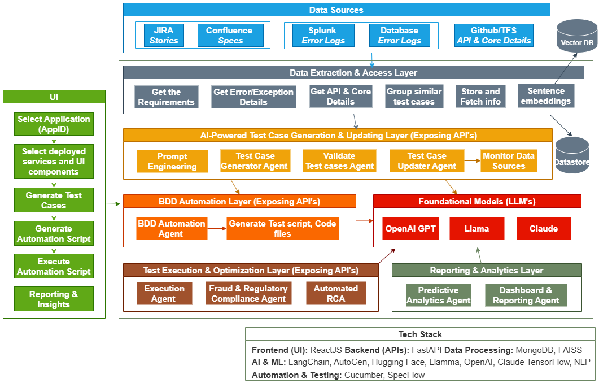
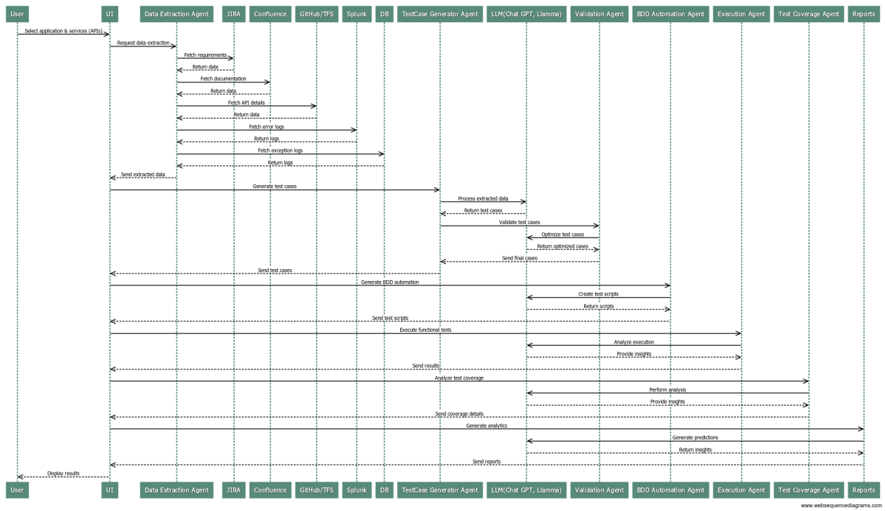

# 🏗️ AI-Powered Testing System Architecture

## Solution Presentation
[Soltution Presentation Demo](https://github.com/ewfx/catfe-ai-challengers/tree/main/artifacts/arch/
(Download Presentation PDF from artifacts/arch folder or click on link.)  

## System Architecture

## Flow Diagram

## Components Description

### 1. Frontend Layer
    - **React Application**
    - User selects the Application and Services from UI. 
    - Triggers the Test case generation, automation script, execute tests and reports & analytics.

### 2. Data Collection & Preprocessing
    - Fetching the relevant information from multiple sources:
    - JIRA & Confluence documents (Engineering specs, user stories).
    - Splunk & Banking Logs (Error logs, transaction failures, security alerts).
    - API Contracts & Financial Workflows (Payments, loan approvals, customer interactions).
    - Database Exception Logs (SQL errors, fraud alerts, failed transactions).

    **Preprocessing**: 
        - NLP-based Data Extraction: Extracts test scenarios from documents and logs. 
        - Vector Similarity Search: Detects duplicate test cases. Data Transformation  
        - Converts unstructured text into structured test case format.

### 3. AI-Powered Test Case Generation & Validation
    - Test Case Generator Agent processes the extracted data using an LLM (e.g., ChatGPT, LLaMA) to create test cases.
    - Generated test cases are sent to the Validation Agent for optimization.
    - Validation Agent processes test cases and sends them to LLM for optimization.
    - LLM returns optimized test cases.

### 4. Automatic Test Case Update
    - Continuous monitoring of JIRA, Confluence, logs, and API definitions detects any changes.
    - When a change is detected, the affected test cases are flagged for modification.
    - Updated data is re-processed through the Test Case Generator Agent and Validation Agent.
    - Modified test cases replace outdated ones, ensuring accuracy and relevance.

### 5. BDD Test Automation
    - UI triggers BDD Automation Agent to generate BDD test scripts.
    - BDD Automation Agent uses LLM to convert test cases into executable scripts.

## 6. Tests Execution and Optimization
    - Multi-threaded execution for faster test runs.
    - High-risk transactions (large-value transfers, cross-border payments) tested first.
    - AI will adjust the testing strategy dynamically based on previous execution results.
    - AI will detect why a test failed and suggest fixes.
    - AI will generate fraudulent transaction patterns to test financial fraud detection system and compliance validation

## 7. Reporting and Analytics
    - The Predictive Analytics Agent will analyze past test results, identify risks, and optimize future test cases.
